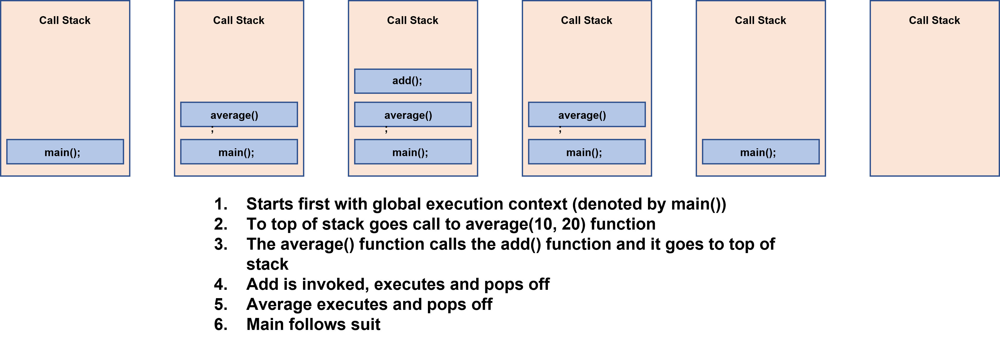

## Class-5 Reading Notes  
<p>The React Docs topic seems super relevant and deals with the subjectivity required to actually architect (for lack of a better term) a React app, where hard decisions are required about fuzzy situations about when to make break out a component into sub-components and where to store state. Higher-order functions are of course relevant, as they describe key concepts in JS.</p>

### Understanding the JavaScript Call Stack

1. What is a ‘call’?
    * Function invocation, i.e. code that invocates the function to execute the code in its code block.
2. How many ‘calls’ can happen at once?
    * One.
3. What does LIFO mean?
    * When we say that the call stack operates by the data structure principle of Last In, First Out, it means that the last function that gets pushed into the stack is the first to be popped out, when the function returns.
4. Draw an example of a call stack and the functions that would need to be invoked to generate that call stack.
    ```
    function add(a, b) {return a + b};
    function average(a, b) {return add(a, b) / 2;}
    let x = average(10, 20); // returns 15
    ```
    

5. What causes a Stack Overflow?
    * A stack overflow occurs when there is a recursive function (a function that calls itself) without an exit point. The browser (hosting environment) has a maximum stack call that it can accomodate before throwing a stack error.

### JavaScript error messages
1. What is a ‘reference error’?
    * 
2. What is a ‘syntax error’?
    * 
3. What is a ‘range error’?
    * 
4. What is a ‘tyep error’?
    * 
5. What is a breakpoint?
    * 
6. What does the word ‘debugger’ do in your code?
    * 

## Things I want to know more about

1. Specific to 'Thinking in React', I am curious about how often significant changes occur to React architecture in the real world, especially for a fast growing company, which may not only be adding whole new product categories with different requirements, but even a new business model, where, e.g. a product company moves to subscription -- basically, I'm curious how 'disruptive' the disruptive company is to itself in terms of web app architecture.