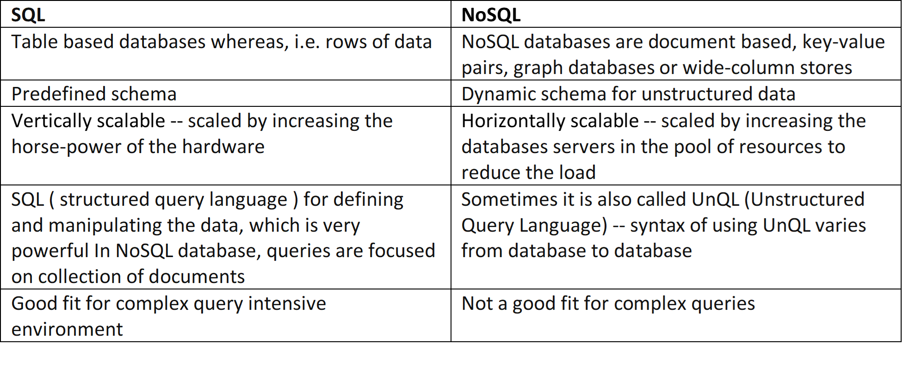

## Class-11 Reading Notes  

I have some familiarity with the differences between sql and no sql from my business background, but look forward to digging deeper.

### nosql vs sql (reading)

1. What kind of data is a good fit for an SQL database?
    * SQL is the programming language used to interface with relational databases. (Relational databases model data as records in rows and tables with logical links between them) -- very good with transactional data.
2. Give a real world example.
    * Classic 'old school' business data like financial transactions / accounting.
3. What kind of data is a good fit for  a NoSQL database?
    * NoSQL databases are often better suited to storing and modeling structured, semi-structured, and unstructured data.

### nosql vs sql (video)

1. What does SQL stand for?
    * Structured Query Language.
2. What is a relational database?
    * A relational database is a collection of information that organizes data in predefined relationships where data is stored in one or more tables (or "relations") of columns and rows, making it easy to see and understand how different data structures relate to each other.
3. What type of structure does a relational database work with?
    * Table(s) with fields (columns) and records (rows).
4. What is a ‘schema’?  
    * Schema references the very strict structure of relational databases, i.e. if the fields are *id/customer/city/orders/order value*, every record must follow that exact format without exception, even if it doesn't have a value for one of the fields.
5. What is a NoSQL database?
    * NoSQL databases (aka "not only SQL") are non-tabular databases and store data differently than relational tables. NoSQL databases come in a variety of types based on their data model. The main types are document, key-value, wide-column, and graph. They provide flexible schemas and scale easily with large amounts of data and high user loads. [Source](https://www.mongodb.com/nosql-explained)
6. How does it work?
    * It is non-tabular and non-relational, there is the concept of collections (Orders / Users / Products) and documents (individual orders / users / products), i.e. your order page can just from the order collections -- one negative is that there is a lot of duplicate data across collections that must be updated in the various siloes.
7. What is inside of a Mongo database?
    * MongoDB stores JSON-like data records as documents (specifically BSON documents) which are gathered together in collections. A database stores one or more collections of documents. [Source](https://www.mongodb.com/docs/manual/core/databases-and-collections/#:~:text=MongoDB%20stores%20data%20records%20as,or%20more%20collections%20of%20documents.)
8. Which is more flexible - SQL or MongoDB? and why.
    * MongoDB (and nosql generally) is considered more flexible because  it is schema-less, i.e. less rigid in terms of data structure.
9. What is the disadvantage of a NoSQL database?
    * It's strength is its weakness effectively -- the schemaless structure which provides the advantages of flexibility and scalability has some disadvantages depending on use case:
        * You can't rely on your record having a certain field, because there is no schema to force it to have it.
        * You also have few / no relations -- great for reading a lot, but a disadvantage if you have a lot of write requests that affect multiple collections, because then you have to update some data in multiple collections because you're duplicating it instead of keeping a relation in place.

## Things I want to know more about

1. I look forward to digging into Mongo -- a company I know of locally that I have a chance to do an initial apprenticeship with has a CMS product based on Mongo.