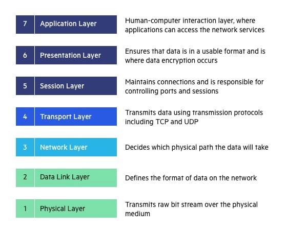

# Class-12 Reading Notes

It's pretty self-evident that security is extremely relevant to the design, development and deployment of web apps.

## [Web Sockets](https://en.wikipedia.org/wiki/WebSocket)

1. What is a Web Socket?
    * WebSocket is a computer communications protocol, providing full-duplex communication channels over a single TCP connection.
    * WebSocket is distinct from HTTP. Both protocols are located at layer 7 in the OSI model and depend on TCP at layer 4.
        * Unlike HTTP, WebSocket provides full-duplex communication.
        * Additionally, WebSocket enables streams of messages on top of TCP. TCP alone deals with streams of bytes with no inherent concept of a message.
        * To achieve compatibility, the WebSocket handshake uses the HTTP Upgrade header to change from the HTTP protocol to the WebSocket protocol.
    * The WebSocket protocol enables interaction between a web browser (or other client application) and a web server with lower overhead than half-duplex alternatives such as HTTP polling, facilitating real-time data transfer from and to the server.
    * This is made possible by providing a standardized way for the server to send content to the client without being first requested by the client, and allowing messages to be passed back and forth while keeping the connection open.
    * In this way, a two-way ongoing conversation can take place between the client and the server. The communications are usually done over TCP port number 443 (or 80 in the case of unsecured connections), which is beneficial for environments that block non-web Internet connections using a firewall.
    * Similar two-way browser–server communications have been achieved in non-standardized ways using stopgap technologies such as Comet or Adobe Flash Player.
2. Describe the Web Socket request/response handshake and what happens once the connection is established.
    * To establish a WebSocket connection, the client sends a WebSocket handshake request, for which the server returns a WebSocket handshake response, as shown in the example below.

    Client request (just like in HTTP, each line ends with \r\n and there must be an extra blank line at the end):

    ```

    GET /chat HTTP/1.1
    Host: server.example.com
    Upgrade: websocket
    Connection: Upgrade
    Sec-WebSocket-Key: x3JJHMbDL1EzLkh9GBhXDw==
    Sec-WebSocket-Protocol: chat, superchat
    Sec-WebSocket-Version: 13
    Origin: http://example.com
    

    ```

    Server response:

    ```
    
    HTTP/1.1 101 Switching Protocols
    Upgrade: websocket
    Connection: Upgrade
    Sec-WebSocket-Accept: HSmrc0sMlYUkAGmm5OPpG2HaGWk=
    Sec-WebSocket-Protocol: chat

    ```
    * The handshake starts with an HTTP request/response, allowing servers to handle HTTP connections as well as WebSocket connections on the same port. 
        * Once the connection is established, communication switches to a bidirectional binary protocol which does not conform to the HTTP protocol.
    * In addition to Upgrade headers, the client sends a Sec-WebSocket-Key header containing base64-encoded random bytes, and the server replies with a hash of the key in the Sec-WebSocket-Accept header. 
        * This is intended to prevent a caching proxy from re-sending a previous WebSocket conversation, and does not provide any authentication, privacy, or integrity. 
        * The hashing function appends the fixed string 258EAFA5-E914-47DA-95CA-C5AB0DC85B11 (a UUID) to the value from Sec-WebSocket-Key header (which is not decoded from base64), applies the SHA-1 hashing function, and encodes the result using base64.
3. Web Sockets provide a standardized way for the server to send content to a client without first receiving a ____ from that client.
    * Request.

## [Socket.io Tutorial](https://www.tutorialspoint.com/socket.io/)

1. What does the event handler io.on() do?
    * The io.on event handler handles connection, disconnection, etc., events in it, using the socket object.
2. Describe some possible proof of life or proof that the code works as expected.
    * Server was set up with log messages on connections and disconnections, e.g. 'A user connected.'
3. What does socket.emit() do? If I get a JWT and I can decode the payload, how can we call that secure?
    * Socket.IO provides the ability to create custom events -- you can create and fire custom events using the socket.emit function.
    * JWT still has the signature as form of protection.

## [Socket.io vs Web Sockets](https://www.educba.com/websocket-vs-socket-io/)

1. What is the difference between WebSocket and Socket.IO? (think Git and GitHub, or OAuth and Auth0).
    * WebSocket is the protocol that is established over the TCP connection, and Socket.IO is the library to work with WebSocket.
2. When would you use Socket.IO?
    * Unlike WebSocket, socket.io allows you to broadcast a message to all connected clients.
    * Proxies and load balancers make it difficult to implement and scale WebSockets. Socket.io supports these technologies.
    * Socket.io can use technologies other than WebSockets if the client does not support WebSockets.
    * If the WebSocket connection drops, it will not automatically reconnect. Socket.io will reconnect automatically.
3. When would you use WebSockets?
    * Every modern browser supports WebSockets these days.
    * Socket.io uses a lot more boilerplate code and resources to make use of other technologies. 
    * Even in terms of network traffic, socket.io is much more expensive.

## [OSI Model Explained](https://www.youtube.com/watch?v=vv4y_uOneC0)

1. What are a couple of key takeaways from this video?
    * I pulled from other resources: 
    * [OSI Model on wikipedia](https://en.wikipedia.org/wiki/OSI_model)


## [TCP handshakes explained](https://www.youtube.com/watch?v=xMtP5ZB3wSk)

1. Translate the gist of this video to a non-technical friend.
    * Before TCP (OSI Layer 4 - Transport layer) transmits data, it will use a three-way handshake to establish a connection.
        * Step 1: Client sends a SYN segment to the server, asking to synchronize, i.e. establish a connection.
        * Step 2: Server replys with SYN-ACK (synchronization and acknowlegement).
            * Acknowledges client request.
            * Asks the client to open a connection too.
        * Step 3: Client replies with ACK, which is effectively like 'yes'

## Bookmarks

1. [Socket.io Documentation](https://socket.io/docs/v4/)
2. [Socket.io Server API](https://socket.io/docs/v4/server-api)
3. [Socket.io Client API](https://socket.io/docs/v4/client-api)
4. [Socket Testing Tool](https://amritb.github.io/socketio-client-tool/)

## Things I want to know more about

1. Web security is a pretty complex realm, and would be good to learn how to navigate that world and understand what best practices are.
