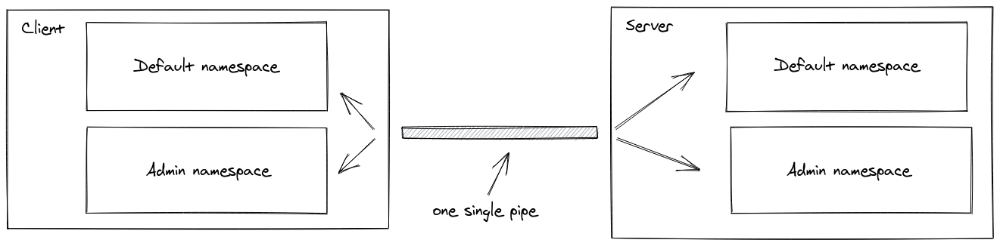

# Class-13 Reading Notes

It's a topic that is very relevant to launching a proper web app.

## [Socket.io Chat Example](https://socket.io/get-started/chat/)

1. Explain to a non-technical recruiter what the Chat Example (above) does.
    * A user can write a message from it's client device (laptop, phone, whatever) and send it to a server (most likely in the cloud), and then server will then 'forward' that message to whomever the message was addressed to -- can to a single addressee, a group, a full-on broadcast to an entire domain / platform, i.e. the server serves as a communications clearing house.
2. What proof of life are we getting on the backend from the above app?
    * Running node index.js on the CLI and hitting the server via the browser on port 3000.
3. Socket.IO gives us the io.emit() method to send an event to everyone. What flag would you use if you want to send a message to everyone except for a certain emitting socket?
    * broadcast, i.e.
    ```
    io.on('connection', (socket) => {
        socket.broadcast.emit('hi');
    });
    ```

## [Rooms](https://socket.io/docs/v4/rooms)

1. What is a room and how might a room be useful?
    * A room is an arbitrary channel that sockets can join and leave. It can be used to broadcast events to a subset of clients.
        * Please note that rooms are a server-only concept (i.e. the client does not have access to the list of rooms it has joined).  
2. How do you join a room?
    * You can call join to subscribe the socket to a given channel:
    ```
    io.on("connection", (socket) => {
        socket.join("some room");
    });
    ```
    * And then simply use to or in (they are the same) when broadcasting or emitting:
    ```
    io.to("some room").emit("some event");
    ```
    * You can emit to several rooms at the same time:
    ```
    io.to("room1").to("room2").to("room3").emit("some event");
    ```
    * In that case, a union is performed: every socket that is at least in one of the rooms will get the event once (even if the socket is in two or more rooms).
    * You can also broadcast to a room from a given socket:
    ```
    io.on("connection", (socket) => {
        socket.to("some room").emit("some event");
    });
    ```
3. How do you leave a room?
    * To leave a channel you call leave in the same fashion as join.

## [Namespaces](https://socket.io/docs/v4/namespaces/)

1. What is a Namespace and what does it allow you to do?
    * A Namespace is a communication channel that allows you to split the logic of your application over a single shared connection (also called "multiplexing").
    
2. Each namespace potentially has its own what? (hint: 3 things)
    * Event handlers.
    * Rooms.
    * Middleware.
3. Discuss a possible use case for separate namespaces?
    * You want to create a special namespace that only authorized users have access to, so the logic related to those users is separated from the rest of the application.
    * Your application has multiple tenants so you want to dynamically create one namespace per tenant.

## Bookmarks

1. [Emit Cheat Sheet](https://socket.io/docs/v4/emit-cheatsheet/)


## Things I want to know more about

1. I would like to dig in deeper on some of the documentation for Socket.io.
