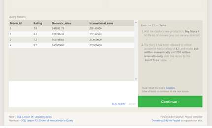
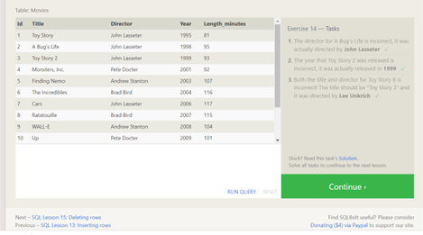
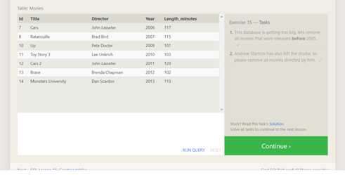
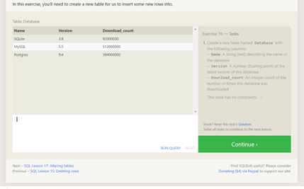
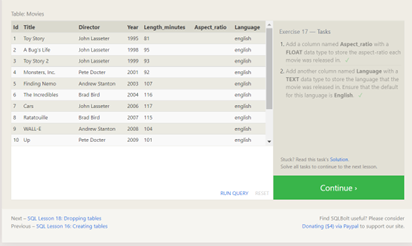
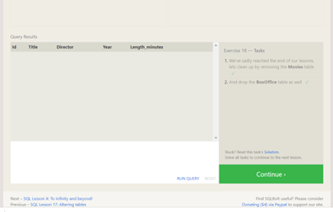

# SQL Practice

## SQL Summary

1. What does SQL stand for?
    * Structured Query Language.
2. What is a relational database?
    * A relational database is a collection of information that organizes data in predefined relationships where data is stored in one or more tables (or "relations") of columns and rows, making it easy to see and understand how different data structures relate to each other.
3. What type of structure does a relational database work with?
    * Table(s) with fields (columns) and records (rows).
4. What is a ‘schema’?  
    * Schema references the very strict structure of relational databases, i.e. if the fields are *id/customer/city/orders/order value*, every record must follow that exact format without exception, even if there isn't a value for one of the fields.
5. What kind of data is a good fit for an SQL database?
    * SQL is the programming language used to interface with relational databases. (Relational databases model data as records in rows and tables with logical links between them) -- very good with transactional data.

## SQL Practice Screen Shots

### Lesson 1

### Lesson 2

### Lesson 3

### Lesson 4

### Lesson 5

### Lesson 6

### Lesson 13

### Lesson 14

### Lesson 15

### Lesson 16

### Lesson 17

### Lesson 18

